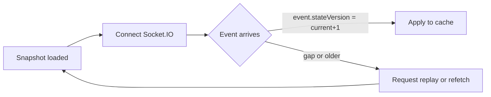

# UI Architecture for Turn‑Based Card Game (Coinche)

## 1) Goals
- **Responsive-first**: Great UX on mobile portrait/landscape, tablets, and desktop.
- **Authoritative server**: Client reconciles to server snapshots/diffs; no hidden info leakage.
- **Fast feedback**: Low-latency event streaming with clear pending/confirmed move states.
- **Reliability**: Seamless reconnect, idempotent POSTs, safe retries, graceful conflict recovery.
- **A11y & i18n**: Keyboard-first play possible; FR/EN ready.

## 2) Recommended Tech Stack
- **Framework**: React 18 + TypeScript 5, built with Vite.
- **Routing**: React Router v6.
- **Data fetching & cache**: TanStack Query (React Query) for REST (`/rooms`, `/games`, snapshots, pagination).
- **Realtime**: Socket.IO client v4 (WebSocket-first with HTTP fallback) connecting to `/socket.io`; central wrapper manages connection lifecycle, rooms, and acknowledgements.
- **State management**: Zustand for local/UI state (modals, layout, drag state), Query cache for server data; no global Redux needed.
- **Forms**: React Hook Form + Zod (validation) for auth settings, room creation.
- **Styling**: Tailwind CSS + Radix UI primitives. Theming via CSS variables (light/dark/high-contrast).
- **Icons**: Heroicons (outline/solid) or Lucide.
- **i18n**: i18next + react-i18next; default `fr-FR` from room metadata.
- **Testing**: Vitest + Testing Library; Playwright for E2E (mobile + desktop viewports).
- **Lint/Format**: ESLint (Airbnb-ish + TS) + Prettier.
- **Build targets**: Modern evergreen browsers. PWA optional (installable + reconnect friendly).

Rationale:
- Aligns with REST + WebSocket push described in `specs/client-server.md` and unlocks bidirectional emits (acks, telemetry) with minimal boilerplate.
- TanStack Query handles caching, retries, and invalidation; Socket.IO events feed low-latency diffs into the cache via typed handlers.

## 3) Domain Model (Typescript)
Mirror server schemas with redaction rules.

```ts
// ids
export type ID = string;

// users/players
export interface PlayerRef { playerId: ID; displayName: string; avatarUrl?: string }

// room
export interface Room {
  roomId: ID;
  gameType: 'coinche';
  status: 'lobby' | 'in_progress' | 'completed';
  hostId: ID;
  maxSeats: number;
  seats: { index: number; playerId: ID | null; ready: boolean }[];
  metadata?: { language?: string };
  createdAt: string; // ISO-8601
}

// game state (public)
export interface GameStatePublic {
  gameId: ID;
  roomId: ID;
  status: 'in_progress' | 'completed';
  turnId: ID;
  turnOrder: ID[];
  stateVersion: number;
  score: { teamA: number; teamB: number };
  contracts: Array<{ team: 'teamA'|'teamB'; type: 'clubs'|'diamonds'|'hearts'|'spades'|'no'|'all'; value: number; coinched?: boolean; surcoinched?: boolean }>;
  tricks: unknown[]; // summarized; UI renders history lazily
  lastUpdated: string;
  publicContainers: {
    drawPileCount?: number;
    discardPileTop?: string | null;
    currentTrick?: { order: Array<{ playerId: ID; card: string }>; };
    trickHistoryCount?: number;
  }
}

// private hand (owner only)
export interface PrivateHand {
  playerId: ID;
  gameId: ID;
  cards: string[]; // e.g., "J♠"
  handVersion: number;
  lastUpdated: string;
}
```

## 4) App Architecture
- **Feature modules**: `auth/`, `lobby/`, `room/`, `game/`, `profile/`, `settings/`, `shared/`.
- **Data flow**:
  - Initial screen loads public lists via REST.
  - On entering a `room` or `game`:
    1. Load snapshot via `GET /games/{gameId}` or `GET /rooms/{roomId}`.
    2. For the active player, load `GET /games/{gameId}/me/hand`.
    3. Connect the shared Socket.IO client (lazy init if already connected).
    4. Emit `join`, receiving ack, for `game:${gameId}:public` channel to receive public events.
    5. If authenticated as the player, also emit `join` for `game:${gameId}:private:${playerId}` to stream hidden-hand updates.
    6. Map incoming events (`turn.move.accepted`, `player.hand.dealt`, etc.) into TanStack Query caches. On version gaps, request replay via REST and re-sync.

- **Socket.IO client service**: Wrapper providing
  - `io(baseUrl, { autoConnect: false, auth: { token } })` with dynamic token injection on connect/reconnect,
  - event translation into app-level dispatcher (typed handler map feeding Query or Zustand stores),
  - reconnection backoff, heartbeat (`pingTimeout`, `pingInterval`) monitoring, and offline detection,
  - helpers `joinChannel` / `leaveChannel` with server acknowledgements and timeouts, logging when join fails.

- **Caching strategy**: Use `queryClient.setQueryData` to merge state diffs; ensure `stateVersion` monotonicity.

- **UI state**: Kept in Zustand stores (layout, selected card, modals, toasts, animations), decoupled from server cache.

- **Optimistic updates**: For UX, render a local “pending card” placeholder in the trick only if move is very likely to pass. Always include `stateVersion` and `Idempotency-Key`. Revert on `409` or `422` with clear UI message.

## 5) Auth
- **OAuth 2.1 + PKCE**: Integrate Google/Facebook. Frontend uses PKCE, gains access/refresh via `POST /auth/oauth/token`.
- **Token storage**: Access token in memory; refresh token in secure, HTTP-only cookie via backend proxy if possible. Avoid localStorage for long-lived secrets.
- **Refresh**: Auto-refresh on 401; queue requests during refresh.

## 6) Networking
- **Base REST**: JSON, all times in ISO-8601 UTC.
- **Idempotency**: All mutating POSTs include `Idempotency-Key` header and `clientMoveId` field when relevant.
- **Retries**: Enable network retries for GET; for POST use idempotency with careful retry/backoff.
- **Reconciliation**: If server returns `409 version_conflict`, refetch latest snapshot, re-apply any safe local UI annotations.
- **Socket.IO handshake**: Use secure WebSocket (`wss://`) transport; provide access token via `auth` payload. Enable fallback long-polling for legacy browsers as a safety net.

## 7) Event Handling & Reconciliation
- Maintain two monotonic sequences:
  - `stateVersion` for public game.
  - `handVersion` for private hand.
- Apply rules:
  - Drop out-of-order diffs; request `GET /games/{gameId}/events?after=evt_x` to backfill.
  - If stream reconnects, request a fresh snapshot and resume with `after=lastSeen`.
  - Never accept events that would reveal other players’ hidden cards.

Pseudo-pipeline:


### Socket.IO channels & events
- `game:${gameId}:public`: emits room/game lifecycle, turn transitions, trick updates, scoreboard diffs.
- `game:${gameId}:private:${playerId}`: emits `player.hand.dealt`, `player.hand.updated`, and other owner-only payloads.
- `room:${roomId}` (optional): lobby seat/ready updates prior to game start.
- Client listens for `system.heartbeat` (15 s) and leverages `connect_error` / `disconnect` events to surface reconnect banners.
- Outgoing emits (e.g., `move.submit`) should include `Idempotency-Key` and expect ack payload `{ accepted: boolean, stateVersion }`; on timeout retry once, then fall back to REST POST.

## 8) Move Submission Flow
- Pre-check `GET /games/{gameId}/turns/current` for `activePlayerId`, `legalMoveTypes`.
- Submit move:
```http
POST /games/{gameId}/turns/current/move
Headers: Authorization, Idempotency-Key: <uuid>
Body: { clientMoveId: <uuid>, moveType: 'play_card', payload: { card: 'J♠' }, stateVersion }
```
- UI states:
  - Pending: card appears slightly translucent in `currentTrick` with spinner.
  - Accepted (`turn.move.accepted`): finalize; bump `stateVersion`.
  - Rejected (`turn.move.rejected` | `illegal_move`): pop toast, return card to hand, show violation details (e.g., required suit).
  - Turn changed (`turn.changed`): update highlights and deadlines.

## 9) Accessibility & Responsiveness
- **Keyboard**: Arrow keys to navigate hand, Enter to play, Esc to cancel; shortcuts for bid values.
- **Screen readers**: ARIA roles for list/grid; live region for events ("Your turn", "Trick won by Team A").
- **Contrast**: WCAG AA; high-contrast theme.
- **Touch**: Large hit targets (min 44px); drag to play optional with cancel affordance.
- **Breakpoints**: sm (mobile portrait), md (mobile landscape), lg (tablet), xl (desktop).

## 10) UI Layouts (ASCII Mockups)

### 10.1 Auth / Landing
```
+------------------------------------------------------+
|  [Logo]  Coinchounet                                 |
|                                                      |
|  [ Google Sign-In ]  [ Facebook Sign-In ]            |
|                                                      |
|  or                                                  |
|  [ Continue as Spectator ]                           |
+------------------------------------------------------+
```

### 10.2 Lobby (Rooms List)
```
+------------------------------------------------------+
| Rooms (coinche)             [Create Room] [Refresh]  |
|------------------------------------------------------|
| # | Room ID    | Seats | Status |   Join     |
|---+------------+-------+--------+------------|
| 1 | room_123   | 3/4   | lobby  | [ Join ]   |
| 2 | room_456   | 4/4   | inprog | [ Spect. ] |
| ...                                              ...|
+------------------------------------------------------+
```

### 10.3 Room (Seating & Ready)
Show the game table (see below) with question marks for the missing players.

### 10.4 Bidding Modal (Coinche/Surcoinche)
```
+---------------- Bid ----------------+
| Trump: (♣ ♦ ♥ ♠  NT  AT)            |
| Value: [ 80 ][ 90 ][100][110][120] |
|                                     |
| [ Coinche ]  [ Surcoinche ]         |
| [ Pass ]      [ Confirm Bid ]       |
+-------------------------------------+
```

### 10.5 Game Table – Desktop (Landscape)
```
+--------------------------------------------------------------------------------+
|                            Score: TeamA 72 | TeamB 54                          |
|--------------------------------------------------------------------------------|
|                             [ Player North (user_222) ]                        |
|                                   (Hand hidden)                                |
|                                                                                |
| [Player West]                                         [Player East]           |
|  (user_111)                                            (user_333)              |
|                                                                                |
|                                    ┌──────────────┐                            |
|            Current Trick:          │  J♠  10♥  A♦ │   (ordered by play)        |
|                                    └──────────────┘                            |
|                                                                                |
| Contracts: Spades 90  [Coinched ✓]                                            |
|--------------------------------------------------------------------------------|
|  Your Hand (user_444):   [ 9♠ ][ A♦ ][ K♥ ][ Q♣ ][ 8♣ ][ 7♦ ][ 10♥ ][ J♠ ]     |
|  Actions: [ Play ] [ Belote ] [ Undo* ]  (*if rules/turn allow)                |
+--------------------------------------------------------------------------------+
```

### 10.6 Game Table – Mobile (Portrait)

The same layout is used, with 2 rows for player hand if it has more than 8 cards.


### 10.7 Toasts / Turn & Violations
```
+-------------------------------+
|  Your turn. You must follow ♥  |
+-------------------------------+
```

### 10.8 Scoreboard Drawer
```
+------------------ Scoreboard ------------------+
| Deals:                                           |
| #12  TeamA 92   TeamB 58   (dix de der → A)     |
| #11  TeamA 110  TeamB 20  (Belote)              |
| ...                                             |
+------------------------------------------------+
```

## 11) Error Handling & Edge Cases
- **401**: Trigger refresh. If refresh fails, return to Auth.
- **409 version_conflict**: Inform user briefly; auto-resync latest snapshot and retry UI.
- **422 illegal_move**: Display rule explanation (`requiredSuit`, etc.).
- **Network drop**: Show reconnect banner; keep UI read-only until resynced.
- **Timeouts**: Use server `deadline` to show countdown; if `turn.move.timeout`, reflect auto-play.

## 12) Performance Guidelines
- Avoid re-render storms by memoizing card components and trick lists.
- Use CSS transforms (translate/scale) for animations; prefer `requestAnimationFrame`.
- Virtualize long lists (trick history, rooms list).
- Preload card SVGs; sprite-sheet or inline SVG for suits/ranks.

## 13) Folder Structure
```
src/
  app/
    App.tsx
    routes.tsx
  api/
    client.ts (fetch, auth, interceptors)
    queries/
      rooms.ts
      games.ts
  realtime/
    socket.ts (Socket.IO client wrapper, channel helpers)
  features/
    auth/
    lobby/
    room/
    game/
      components/
      hooks/
      state.ts (Zustand for UI)
    settings/
  shared/
    components/
    hooks/
    models/ (TS types)
    utils/
  styles/
    index.css (Tailwind)
```

## 14) Testing Strategy
- **Unit**: Components (Vitest + RTL) for cards, trick, bidding modal.
- **Integration**: Socket.IO event bridge + Query cache updates (simulate `turn.move.accepted`, `player.hand.dealt`).
- **E2E**: Playwright flows
  - Auth happy path.
  - Create room, join, ready, start.
  - Play a legal card; ensure state reconciles.
  - Illegal move shows `requiredSuit` hint.
  - Reconnect after simulated drop; assert `connect_error` banner and automatic resubscribe to channels.

## 15) Security & Privacy
- HTTPS only; include `Authorization: Bearer` on all calls except `GET /health`.
- Don’t log access tokens or private cards. Redact PII in client logs.
- Prevent SSR of private data; SPA mode is preferred.
- Respect server redaction: never render other players’ hands; show counts only.

## 16) Deployment Notes
- Static hosting (Netlify/Vercel) with environment variables for API base URL and OAuth provider config.
- CSP: default-src 'self'; connect-src 'self' https://api.example.com; img-src avatars; font-src; upgrade-insecure-requests.

## 17) Roadmap (nice-to-have)
- Spectator mode enhancements (multi-table view).
- PWA offline lobby & read-only replay of past deals.
- Theming: card skins, colorblind-friendly suits.

--
This document aligns with `specs/client-server.md` (REST + SSE, versioning, private hand delivery/redaction) and `specs/rules.md` (coinche bidding, coinche/surcoinche, belote, trick logic).
